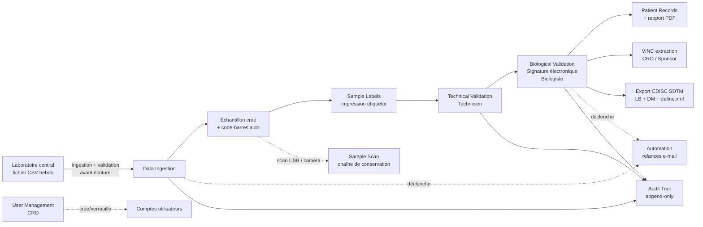

BLOOD Study LIMS
LIMS Streamlit pour la gestion des résultats de bilan sanguin dans un essai clinique diabète (workflow CDISC SDTM).
État du projet
Domaine	Statut
Workflow métier (ingestion → validation → export)	✅ Fait
Sécurité des comptes (verrouillage, désactivation, mdp oublié)	✅ Fait
Code-barres (émission + lecture USB/caméra)	✅ Fait
Automatisation (relances e-mail)	✅ Fait (limites : voir plus bas)
Export CDISC (LB, DM, define.xml starter)	✅ Fait (starter, à compléter avant dépôt réel)
Documentation de validation (IQ/OQ/PQ)	✅ Modèle fourni (`CSV_Protocol_BLOOD_LIMS.docx`)
Tests automatisés + CI	✅ Fait (26 tests, GitHub Actions)
Données de démo	✅ Fait (`seed_demo_data.py`)
Import HL7 v2 (ORU^R01)	✅ Fait — voir limite ci-dessous (pas d'écoute réseau temps réel)
RGPD (export, pseudonymisation, consentement)	✅ Fait — voir limite ci-dessous (ne remplace pas HDS)
Diffusion auto des comptes rendus (PDF chiffré)	✅ Fait — voir limite ci-dessous (pas MSSanté)
Logos / captures d'écran	⚠️ Logos placeholder fournis — remplacez-les par les vôtres
PostgreSQL / haute disponibilité	⏳ Non fait, nécessite un compte externe (voir README)
Hébergement certifié HDS	⏳ Non fait — nécessaire pour de vraies données patients (voir README)
Arborescence
```
gdp-dashboard/  (racine de votre repo)
├── streamlit_app.py        # Point d'entrée Streamlit, pages
├── db.py                   # Connexion SQLite + CRUD
├── auth.py                 # Authentification, verrouillage, mdp oublié
├── audit.py                 # Piste d'audit (écriture unique)
├── migrations.py            # Migrations de schéma versionnées, idempotentes
├── business_logic.py        # Calculs métier (testés par tests/)
├── barcode_utils.py         # Génération + lecture code-barres
├── pdf_reports.py           # Rapports PDF (patient, VINC)
├── cdisc_export.py          # Domaine DM + define.xml
├── automation.py            # Relances e-mail
├── ui.py                    # CSS, bannière, page d'accueil
├── constants.py             # Rôles, permissions, constantes
├── seed_demo_data.py        # Génère 25 patients fictifs pour une démo présentable
├── schema.sql               # Schéma SQLite (état final pour une base neuve)
├── conftest.py               # Permet à pytest d'importer les modules du projet
├── pytest.ini
├── requirements.txt
├── requirements-dev.txt      # pytest (dev uniquement, pas déployé)
├── packages.txt               # dépendances système (libzbar0 pour la caméra)
├── tests/                      # 26 tests unitaires sur business_logic.py
├── .github/workflows/tests.yml # CI : tests lancés à chaque push
├── assets/                      # logos (placeholders fournis, à remplacer)
├── CSV_Protocol_BLOOD_LIMS.docx # modèle de protocole IQ/OQ/PQ
└── .streamlit/secrets.toml.example
```
Workflow

Installation locale
```bash
pip install -r requirements.txt
cp .streamlit/secrets.toml.example .streamlit/secrets.toml   # optionnel, pour les e-mails
streamlit run streamlit_app.py
```
Données de démonstration
Pour ne pas présenter une application vide devant un jury/recruteur/sponsor :
```bash
python seed_demo_data.py
```
Génère 25 patients fictifs répartis sur 3 sites, avec des résultats à différents stades du workflow (PENDING / TECHNICAL_OK / REVIEWED) et une proportion réaliste de valeurs hors-norme (~15%) et critiques (~2%), pour que le Dashboard, les graphiques et les pages de validation aient tous quelque chose à montrer. Le script est idempotent : le relancer ne duplique rien. Pour repartir de zéro, supprimez `blood_study.db` puis relancez.
Ne jamais lancer ce script sur une base contenant de vraies données patients.
Tests automatisés
```bash
pip install -r requirements-dev.txt
pytest
```
26 tests couvrent `business_logic.py` : détection outlier/critique (`compute_oor_flag`), calcul du temps de traitement (`compute_tat_hours`), validation du CSV à l'ingestion (`validate_ingestion_dataframe`), et la matrice de complétude des visites (`build_patients_matrix`). Ces fonctions ont volontairement aucune dépendance à Streamlit ou à la base — elles se testent en isolation, sans mock.
`.github/workflows/tests.yml` relance cette suite automatiquement à chaque `git push` (gratuit sur un repo GitHub public) : si une modification casse un calcul métier, vous le voyez dans l'onglet "Actions" de GitHub avant même de redéployer.
Déploiement sur Streamlit Community Cloud (gratuit)
Poussez ce dossier à la racine de votre repo GitHub.
Sur share.streamlit.io, fichier principal : `streamlit_app.py`.
`requirements.txt` et `packages.txt` sont détectés automatiquement (`requirements-dev.txt` n'est PAS nécessaire en production, seulement en local/CI pour les tests).
Pour activer les e-mails (relances + mot de passe oublié) : App settings → Secrets, collez le contenu de `.streamlit/secrets.toml.example` avec vos vrais identifiants SMTP.
Remplacez les logos placeholder dans `assets/` par les vôtres : `logo_central_lab_results.png`, `logo_clinical_services.png`, `logo_lph.png` (mêmes noms de fichier, PNG).
Captures d'écran (à ajouter par vous)
Une fois déployé avec les données de démo (`python seed_demo_data.py`), prenez 3-4 captures et glissez-les ici :
Dashboard (KPIs + graphiques)
Sample Scan (recherche par code-barres)
Biological Validation (signature électronique)
Audit Trail
```markdown


```
Migration automatique de la base existante
Si vous avez déjà une base `blood_study.db` créée par une ancienne version de ce projet, rien à faire manuellement : au premier redémarrage, `migrations.py` détecte les colonnes/tables manquantes et les ajoute sans toucher aux données existantes. Une ligne `MIGRATION_APPLIED` apparaît dans l'Audit Trail pour le prouver.
Gestion des utilisateurs
Le CRO dispose d'une page User Management : création de compte (mot de passe temporaire à usage unique, changement forcé), désactivation/réactivation, changement de rôle, réinitialisation de mot de passe, verrouillage automatique après 5 échecs de connexion (15 minutes), et "mot de passe oublié" en self-service par e-mail.
Conformité réglementaire
`CSV_Protocol_BLOOD_LIMS.docx` : modèle de protocole IQ/OQ/PQ à compléter, faire tester et faire approuver par votre CRO/sponsor avant toute utilisation avec de vraies données patients.
Signature électronique : capture le motif ("meaning of signature", 21 CFR Part 11 §11.50) et affiche la mention légale d'engagement avant signature.
Export CDISC : domaines LB et DM + un `define.xml` de départ — à compléter et valider avec un outil de conformité type Pinnacle 21 avant tout dépôt réel (voir avertissement dans `cdisc_export.py`).
Sauvegarde manuelle : Settings → Backup. Politique recommandée : au moins hebdomadaire, stockée ailleurs que sur l'appli elle-même.
Limites connues
SQLite : adapté à un usage mono-instance / faible concurrence. Migrez vers PostgreSQL si la charge ou le nombre de sites augmente fortement.
Automatisation par e-mail : déclenchée à chaque chargement de page, pas de vrai cron sur le tier gratuit Streamlit.
Comptes de démonstration : les mots de passe en clair dans `schema.sql` (en commentaire) sont uniquement pédagogiques — régénérez-les avant toute donnée patient réelle.
Import HL7 (`hl7_import.py`) : lit un fichier HL7 v2 déjà reçu. Il n'écoute PAS un port réseau/série en temps réel (MLLP/RS-232) — un vrai lien direct avec un automate nécessite un service séparé qui tourne en permanence dans le réseau du laboratoire, ce qui n'est pas possible depuis une application Streamlit (Cloud ou non).
RGPD / HDS (`gdpr.py`) : les fonctions d'export et de pseudonymisation rapprochent l'application de la conformité RGPD, mais NE remplacent PAS un hébergement certifié HDS (Hébergement de Données de Santé). Streamlit Community Cloud n'est pas certifié HDS — pour de vraies données patients identifiantes en France, un hébergeur certifié (ex: OVHcloud HDS) est légalement nécessaire, et c'est une décision d'infrastructure, pas de code.
Diffusion automatique des comptes rendus (`automation.send_secure_report`) : envoie par SMTP classique avec PDF chiffré par mot de passe. Ce n'est PAS MSSanté — MSSanté nécessite une accréditation ANS via un opérateur agréé. Le point d'intégration est préparé dans le code (voir le commentaire dans `automation.py`) pour brancher un vrai opérateur le jour venu.