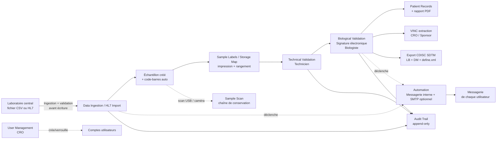

BLOOD Study LIMS
LIMS Streamlit pour la gestion des résultats de bilan sanguin dans un essai clinique diabète (workflow CDISC SDTM).
État du projet
Domaine	Statut
Workflow métier (ingestion → validation → export)	✅ Fait
Sécurité des comptes (verrouillage, désactivation, mdp oublié)	✅ Fait
Code-barres (émission + lecture USB/caméra)	✅ Fait
Import HL7 v2 (ORU^R01)	✅ Fait — voir limite ci-dessous (pas d'écoute réseau temps réel)
Messagerie interne + espace "Mon Compte"	✅ Fait — relances et comptes rendus livrés réellement, sans SMTP
Automatisation (relances, diffusion auto des comptes rendus)	✅ Fait
RGPD (export, pseudonymisation, consentement)	✅ Fait — voir limite ci-dessous (ne remplace pas HDS)
Export CDISC (LB, DM, define.xml starter)	✅ Fait (starter, à compléter avant dépôt réel)
Visualisation du workflow (schéma live + frise par patient)	✅ Fait
Carte de stockage des échantillons	✅ Fait
Documentation de validation (IQ/OQ/PQ)	✅ Modèle fourni (`CSV_Protocol_BLOOD_LIMS.docx`)
Tests automatisés + CI	✅ Fait (57 tests, GitHub Actions)
Données de démo	✅ Fait (`seed_demo_data.py`)
Logos / captures d'écran	⚠️ Logos placeholder fournis — remplacez-les par les vôtres
PostgreSQL / haute disponibilité	⏳ Non fait, nécessite un compte externe (voir plus bas)
Hébergement certifié HDS	⏳ Non fait — nécessaire pour de vraies données patients (voir plus bas)
Arborescence
```
gdp-dashboard/  (racine de votre repo)
├── streamlit_app.py        # Point d'entrée Streamlit, pages
├── db.py                   # Connexion SQLite + CRUD
├── auth.py                 # Authentification, verrouillage, mdp oublié
├── audit.py                 # Piste d'audit (écriture unique)
├── mailbox.py                # Messagerie interne (voir section dédiée)
├── migrations.py              # Migrations de schéma versionnées, idempotentes
├── business_logic.py           # Calculs métier (testés par tests/)
├── barcode_utils.py             # Génération + lecture code-barres
├── workflow_viz.py                # Schéma de pipeline live + frise + carte de stockage
├── pdf_reports.py                  # Rapports PDF (patient, VINC)
├── cdisc_export.py                  # Domaine DM + define.xml
├── automation.py                     # Relances + diffusion auto (messagerie + SMTP optionnel)
├── ui.py                              # CSS, bannière, page d'accueil, comptes de démo
├── constants.py                        # Rôles, permissions, icônes de navigation
├── hl7_import.py                        # Parseur HL7 v2 (ORU^R01)
├── gdpr.py                               # Droits RGPD
├── seed_demo_data.py                      # Génère 25 patients fictifs pour une démo présentable
├── schema.sql                              # Schéma SQLite (état final pour une base neuve)
├── conftest.py                              # Permet à pytest d'importer les modules du projet
├── pytest.ini
├── requirements.txt
├── requirements-dev.txt                      # pytest (dev uniquement, pas déployé)
├── packages.txt                               # dépendances système (libzbar0 pour la caméra)
├── tests/                                      # 57 tests unitaires (business logic, db, mailbox, migrations)
├── .github/workflows/tests.yml                  # CI : tests lancés à chaque push
├── assets/                                       # logos (placeholders fournis, à remplacer)
├── CSV_Protocol_BLOOD_LIMS.docx                   # modèle de protocole IQ/OQ/PQ
└── .streamlit/secrets.toml.example
```
Workflow

Installation locale
```bash
pip install -r requirements.txt
cp .streamlit/secrets.toml.example .streamlit/secrets.toml   # optionnel, pour un vrai SMTP en plus
streamlit run streamlit_app.py
```
Messagerie interne — pourquoi, et comment ça marche
Sans identifiants SMTP réels, l'automatisation ne peut pas envoyer de vrais e-mails de façon démontrable. Plutôt que de rester sur une simple simulation, chaque relance (import en retard, extrait VINC non téléchargé, valeurs critiques, comptes rendus signés) est réellement livrée dans une boîte de réception interne à l'application — même principe qu'une messagerie universitaire (identifiant du site, pas un vrai compte Gmail/Outlook).
Page Messagerie : boîte de réception avec pièces jointes (PDF), et possibilité d'écrire à un autre utilisateur.
Page Mon Compte : nom, poste, e-mail modifiables ; changement de mot de passe. Nom d'utilisateur et rôle restent réservés au CRO (page User Management), par principe de séparation des responsabilités.
Un vrai envoi SMTP est fait en plus, automatiquement, si vous configurez un jour de vrais identifiants dans `.streamlit/secrets.toml` — les deux canaux ne s'excluent pas.
Données de démonstration
```bash
python seed_demo_data.py
```
Génère 25 patients fictifs répartis sur 3 sites, avec des résultats à différents stades du workflow et une proportion réaliste de valeurs hors-norme (~15%) et critiques (~2%). Idempotent : le relancer ne duplique rien. Ne jamais lancer ce script sur une base contenant de vraies données patients.
Tests automatisés
```bash
pip install -r requirements-dev.txt
pytest
```
57 tests couvrent `business_logic.py` (calculs purs), `db.py` (CRUD, verrouillage de compte, jetons de réinitialisation), `mailbox.py` (livraison, lecture croisée bloquée, pièces jointes) et `migrations.py` (chaque migration rejouée sur une base ancienne simulée, y compris le bug de dépendance circulaire entre la migration 1 et la migration 4 découvert et corrigé grâce à ces tests). `.github/workflows/tests.yml` relance cette suite à chaque `git push`.
Déploiement sur Streamlit Community Cloud (gratuit)
Poussez ce dossier à la racine de votre repo GitHub.
Sur share.streamlit.io, fichier principal : `streamlit_app.py`.
`requirements.txt` et `packages.txt` sont détectés automatiquement.
Pour activer un vrai SMTP en plus de la messagerie interne : App settings → Secrets, collez le contenu de `.streamlit/secrets.toml.example`.
Remplacez les logos placeholder dans `assets/` par les vôtres.
Migration automatique de la base existante
`migrations.py` détecte et rattrape automatiquement le schéma d'une base créée par une version antérieure de ce projet, sans toucher aux données existantes. 4 migrations à ce jour (gestion des utilisateurs, RGPD/HL7, messagerie interne, correctif `AUDIT_TRAIL.record_ref`) — une ligne `MIGRATION_APPLIED` apparaît dans l'Audit Trail à chaque application.
Conformité réglementaire
`CSV_Protocol_BLOOD_LIMS.docx` : modèle de protocole IQ/OQ/PQ à compléter et faire approuver avant toute utilisation avec de vraies données patients.
Signature électronique : capture le motif ("meaning of signature", 21 CFR Part 11 §11.50) et affiche la mention légale d'engagement.
Export CDISC : domaines LB et DM + un `define.xml` de départ — à compléter et valider avec un outil type Pinnacle 21 avant tout dépôt réel.
Sauvegarde manuelle : Settings → Backup.
Limites connues
SQLite : adapté à un usage mono-instance / faible concurrence. Migrez vers PostgreSQL (Supabase ou Neon ont un vrai tier gratuit) si la charge ou le nombre de sites augmente.
Automatisation : vérifiée à chaque chargement de page (pas de vrai cron serveur sur le tier gratuit Streamlit) — mais la livraison en messagerie interne, elle, fonctionne réellement dès qu'une page est ouverte.
Import HL7 : lit un fichier déjà reçu, n'écoute pas un port réseau/série en temps réel (MLLP/RS-232) — nécessiterait un service séparé tournant en permanence dans le réseau du laboratoire.
RGPD / HDS : les fonctions d'export et de pseudonymisation rapprochent l'application de la conformité RGPD, mais ne remplacent PAS un hébergement certifié HDS, obligatoire pour de vraies données patients identifiantes en France.
MSSanté : la diffusion automatique des comptes rendus n'est pas une messagerie de santé accréditée ANS — voir le commentaire dans `automation.py` pour le point d'intégration prévu le jour où vous avez un compte opérateur.
Comptes de démonstration : les mots de passe en clair dans `schema.sql` (en commentaire) sont uniquement pédagogiques — régénérez-les avant toute donnée patient réelle.